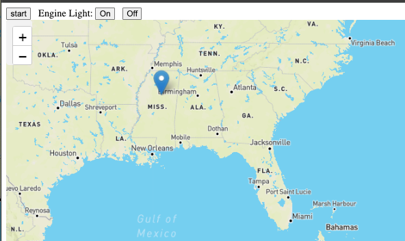

# Vehicle Server





## Running the server


```shell
java -jar applications/server/vehicle-server/target/vehicle-server-0.0.1-SNAPSHOT.jar --vehicle.vin=vin002 --server.port=7012 --gemfire.jmx.manager.port=20392 --gemfire.server.port=20302 --gemfire.startLocators="localhost[3012]" --gemfire.working.dir=runtime/vin002 --position.latitude=37.58388784106871 --position.longitude=-71.29707193977676 --gemfire.distributedSystemId=2
```

