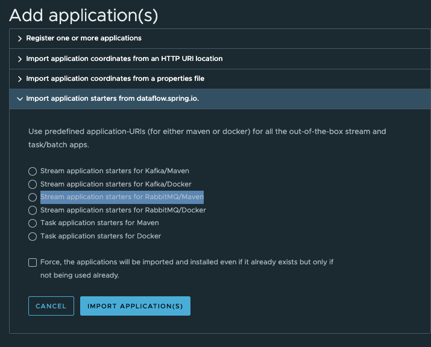
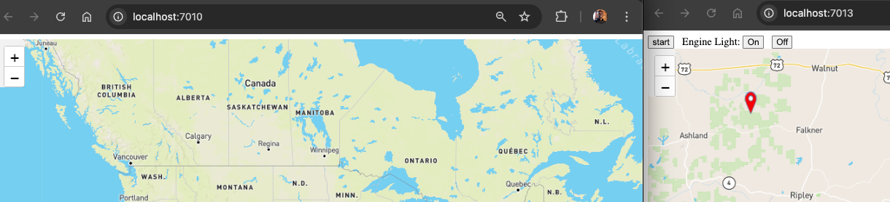

# Demo


The demo currently saves order records to Postgres when a change oil indicator is turned on.  

The vehicle details and change oil status are sames in an embedded GemFire. They are synced to a different GemFire instance. The events from the GemFire car instance survives outage/networks issues with a central GemFire instance. SCDF is used to sync data from GemFire central instance to Postgres. Postgres can be replaced with Greenplum.


## Prerequisite

- Apache Maven 3.9.1 or higher 
- Docker
- Java 17
- [wget](https://www.gnu.org/software/wget/)


## Getting Started

Start Gemfire

```shell
docker network create gemfire-cache --driver bridge
./deployments/local/dataServices/gemfire/start-docker-gemfire.sh
```


Start GemFire management console

```shell
./deployments/local/dataServices/gemfire/start-gideon-docker.sh
```

```shell
open http://localhost:7077
```


Start Postgres

```sql
docker run -it --rm --name postgres -p 5432:5432 -e POSTGRES_USER=postgres -e POSTGRES_PASSWORD=postgres debezium/example-postgres:2.3.3.Final
```

Connect to Postgres database using psql

```shell
docker exec -it postgres psql -d postgres -U postgres
```

Create table

```shell
CREATE TABLE vehicle_orders (
    order_id    serial primary key,
    vin varchar(255) not null,
    order_item varchar(255) not null,
    order_dt timestamp default current_timestamp
);
```


```shell
SELECT * FROM pg_stat_activity;
```
Test

```sql
insert into vehicle_orders(vin, order_item) values('TESTVIN',
'TEST ORDER');

select * from vehicle_orders;
```

Start Vehicle  Running in Docker

Start 002

```shell
docker run  --rm  --name vin002 --network=gemfire-cache  -p 7012:7012 cloudnativedata/vehicle-server:0.0.1-SNAPSHOT  --vehicle.vin=vin002 --server.port=7012 --gemfire.jmx.manager.port=20392 --gemfire.server.port=20302 --gemfire.startLocators="vin002[3012]" --gemfire.bind.address=vin002 --gemfire.jmx.host.name.for.clients=vin002 --gemfire.host.name.for.clients=vin002 --gemfire.working.dir=runtime/vin002 --position.latitude=36.587874310729106 --position.longitude=-74.67391992563381 --gemfire.distributedSystemId=2 --gemfire.http.service.port=7072 --gemfire.remoteLocators="gf-locator[10334]"
```

```shell
open http://localhost:7012
```

Start 003

```shell
docker run  --rm  --name vin003 --network=gemfire-cache -p 7013:7013 cloudnativedata/vehicle-server:0.0.1-SNAPSHOT  --vehicle.vin=vin003 --server.port=7013 --gemfire.jmx.manager.port=20399 --gemfire.server.port=20300 --gemfire.startLocators="vin003[3013]" --gemfire.bind.address=vin003 --gemfire.jmx.host.name.for.clients=vin003 --gemfire.host.name.for.clients=vin003 --gemfire.working.dir=runtime/vin003 --position.latitude=37.58388784106871 --position.longitude=-71.29707193977676 --gemfire.distributedSystemId=3 --gemfire.http.service.port=7072 --gemfire.remoteLocators="gf-locator[10334]"
```

```shell
open http://localhost:7013
```


Start Vehicle Dashboard

```shell
docker run  --rm  --name dashboard --network=gemfire-cache  -p 7010:7010 cloudnativedata/vehicle-dashboard:0.0.1-SNAPSHOT --server.port=7010 --spring.profiles.active=gemfire --spring.data.gemfire.pool.default.locators="gf-locator[10334]"
```

Open dashboard

```shell
open http://localhost:7010
```


Setup GMC

```shell
http://localhost:7077/login
```

connect

```properties
name=gemfire-cluster
host=gf-locator
port=7070
```


connect

```properties
name=ship003
host=vin003
port=7072
```


## Install/Start SCDF

```shell
./deployments/local/spring/scdf/scdf-install.sh 
```

-----------------------------------
# SCDF

## SCDF Setup

```shell
./deployments/local/spring/scdf/scdf-install.sh 
```


```shell
open http://localhost:9393/dashboard
```

- Click "Add application(s) -> Stream application starters for RabbitMQ/Maven -> IMPORT APPLICATIONS

- 


## Create DataFlow

Click Streams -> Create STREAM(S)


Paste the following definition

```shell
check-engine-light=gemfire: geode --region-name=Vehicle --query="select * from /Vehicle where checkEngine=true" --pdx-read-serialized=true --subscription-enabled=true | greenplum:upsert
```


```properties
app.gemfire.geode.client.pdx-read-serialized=true
app.gemfire.geode.pool.subscription-enabled=true
app.gemfire.geode.region.region-name=Vehicle
app.gemfire.geode.supplier.query=select * from /Vehicle where checkEngine=true
app.greenplum.jdbc.upsert.insert-sql=insert into vehicle_orders(vin, order_item) values(:vin,'SYNTHETIC OIL')
app.greenplum.spring.datasource.driver-class-name=org.postgresql.Driver
app.greenplum.spring.datasource.url=jdbc:postgresql://localhost/postgres
app.greenplum.spring.jpa.properties.hibernate.dialect=org.hibernate.dialect.PostgreSQLDialect
app.greenplum.spring.datasource.username=postgres
app.greenplum.spring.datasource.password=postgres
deployer.gemfire.bootVersion=2
deployer.greenplum.bootVersion=3
```


Open Vehicle Server
```shell
open http://localhost:7010
```

Open Dashboard
```shell
open http://localhost:7010
```


----------------

# Testing 


Tight light on/off to trigger event to save an oil order to Postgres




------------

# Clean up

```shell
docker rm -f gf-server1
docker rm -f gf-locator
```